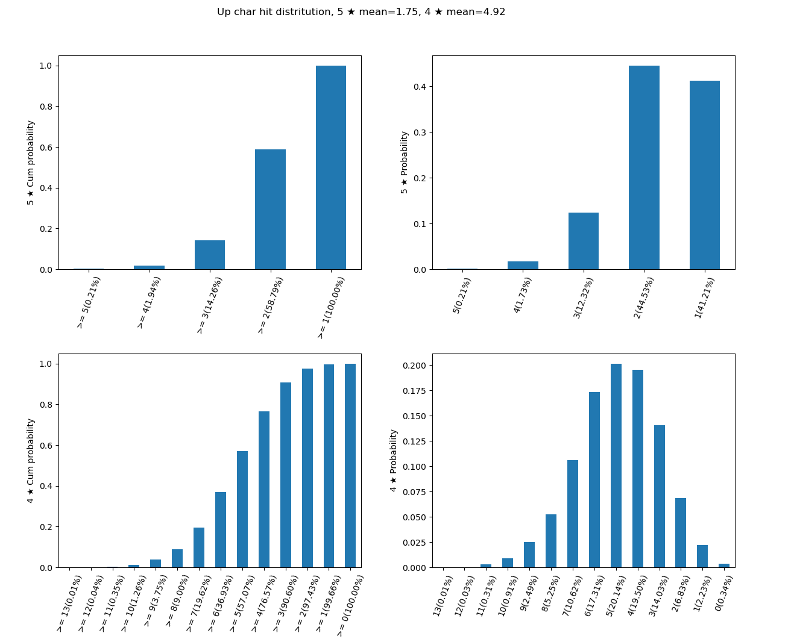

# Genshin Impact Banner Pull Estimation (via Monte Carlo)

This tool answsers the following question:

I've pulled 45 times in the last banner since my last five star hit; I will pull 174 times in the current banner. How many 5 ★ characters will I get? How many 4 ★ characters I will get?

The tool answer this question by running the 174 pulls many many times and report the statistics in a graph. It tells you the accumulative probability of getting more than 3 hit, the probability of hitting 2 times exactly, and the average (mean value).

# Usage

Using the example a bove, the code below simulate and report the result.

```bash
python char_wish.py --num_wish=174 --num_no_five_star=45
```



## Options
--last_five_star_no_up, set if last five star hit was not the UP character

--last_four_star_no_up, set if last five star hit was not one of the the UP characters

--num_sim, number of simulation, default is 10K
